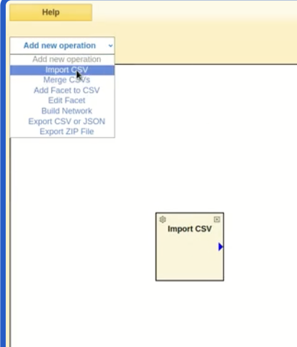
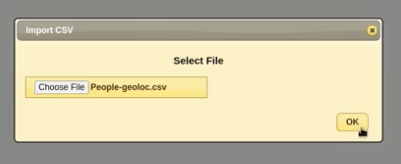
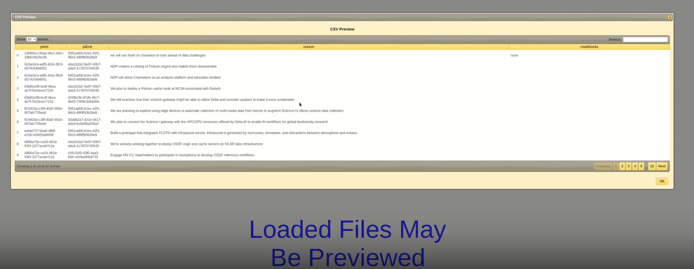
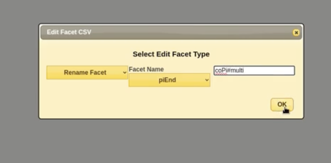
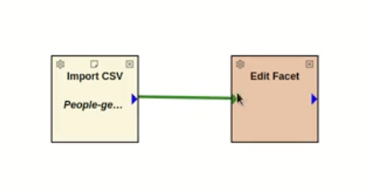
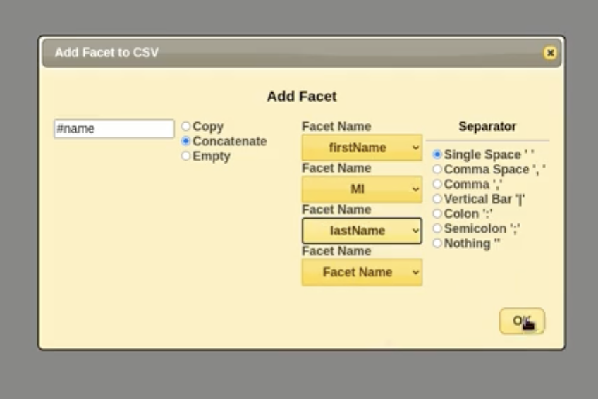
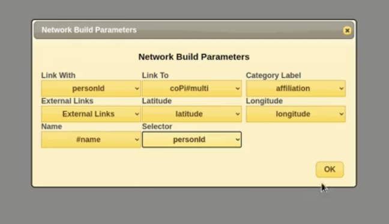
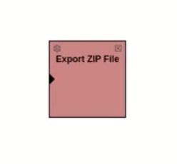

# CorpusDB Merge User Guide

This guide walks you through the steps for using **CorpusDB Merge**.

---

## Step 1: Add Import Image Filter
Insert the Import Image Filter into your workspace.  

---

## Step 2: Select Input File
Select the input file you want to use.  

### Preview Loaded Files
Loaded files may be previewed before proceeding:  

### Edit or Delete Facets
Facets may be edited or deleted as needed:  

---

## Step 3: Connect Tabs
Connect by clicking the tab, dragging, and clicking the connecting tab.  

---

## Step 4: Add a New Facet
Add a new facet to your workspace.  

---

## Step 5: Rename Facet to Prepare for Merge
Rename the facet to prepare it for merging.  
![Rename Facet]

---

## Step 5 (continued): Choose Merge Selector Facets
Choose the facets you want to merge.  

---

## Step 6: Build the Network
Build the network based on your selected facets.  

---

## Step 7: Save Network in ZIP File
Save the completed network in a `.zip` file for future use.  

