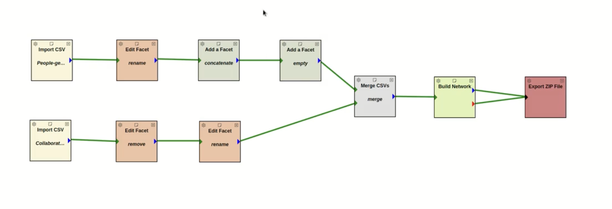

This guide walks you through the steps for using **CorpusDB Merge**.

---

## Step 1: Add Import Image Filter
Insert the Import Image Filter into your workspace.  


---

## Step 2: Select Input File
Select the input file you want to use.  


### Preview Loaded Files
Loaded files may be previewed before proceeding:  


### Edit or Delete Facets
Facets may be edited or deleted as needed:  


## Step 2: Select Input File
Select the input file you want to use.  


### Example: Importing Multiple CSV Files
You can import more than one CSV file into CorpusDB Merge.  
For example:

- **[Collaborations.csv](images/merge_image/Collaborations.csv)** – containing collaboration data between principal investigators.
- **[People-geoloc.csv](images/merge_image/People-geoloc.csv)** – containing geolocation and affiliation information for people.

#### Preview of People-geoloc.csv
```csv
awardId,firstName,lastName,email,middleInitial,affiliation,address,city,countryCode,stateCode,zipCode,latitude,longitude,location,affiliateType,personId
2331480,Brian,Bockelman,bbockelman@morgridge.org,P,THE MORGRIDGE INSTITUTE FOR RESEARCH, INC.,330 N ORCHARD ST,MADISON,US,WI,537151119,43.0728101,-89.4080519718417,"330 N ORCHARD ST, MADISON, WI, 537151119",PI,eba1b1b2-5e97-40b7-ada3-1c7870745535
2333609,Ilkay,Altintas,altintas@sdsc.edu,,UNIVERSITY OF CALIFORNIA, SAN DIEGO,9500 GILMAN DR,LA JOLLA,US,CA,920930021,32.87924375,-117.231124683773,"9500 GILMAN DR, LA JOLLA, CA, 920930021",PI,0c0ac0ca-adf5-4c5c-8fc9-d574c54b8051
2331263,Peter,Beckman,peter.beckman@northwestern.edu,H,NORTHWESTERN UNIVERSITY,633 CLARK ST,EVANSTON,US,IL,602080001,42.0557157,-87.6752945473942,"633 CLARK ST, EVANSTON, IL, 602080001",PI,72637c9f-1768-4d0b-816e-331356f974a6
```
#### Preview of Collaborations.csv
```csv
piInit,piEnd,reason,roadblocks
1d6f06cc-93ae-4bc1-bfec-18b618e2bc30,5951ad06-b1ec-42f1-96c5-486ffb3b26e8,"we will use fount on chamelon to train ahead of data challenges",none
0c0ac0ca-adf5-4c5c-8fc9-d574c54b8051,eba1b1b2-5e97-40b7-ada3-1c7870745535,"NDP creates a catalog of Pelican origins and makes them discoverable",
0c0ac0ca-adf5-4c5c-8fc9-d574c54b8051,5951ad06-b1ec-42f1-96c5-486ffb3b26e8,"NDP will utilize Chameleon as an analysis platform and education testbed"
```

---

## Step 3: Connect Tabs
Connect by clicking the tab, dragging, and clicking the connecting tab.  


---

## Step 4: Add a New Facet
Add a new facet to your workspace.  


## Rename Facet to Prepare for Merge
Rename the facet to prepare it for merging.  
![Rename Facet]


### Example: Adding Facets to People-geoloc.csv
In this example, after importing **People-geoloc.csv**, we add:

- A **new facet** called `#name` to combine `firstName` ,`MI`, `lastName`.
- An **empty facet** called `coPi#multi` to hold potential co-principal investigator values.

Updated table preview:

```csv
awardId,firstName,lastName,#name,email,middleInitial,affiliation,address,city,countryCode,stateCode,zipCode,latitude,longitude,location,affiliateType,personId,coPi#multi
2331480,Brian,Bockelman,Brian Bockelman,bbockelman@morgridge.org,P,THE MORGRIDGE INSTITUTE FOR RESEARCH, INC.,330 N ORCHARD ST,MADISON,US,WI,537151119,43.0728101,-89.4080519718417,"330 N ORCHARD ST, MADISON, WI, 537151119",PI,eba1b1b2-5e97-40b7-ada3-1c7870745535,
2333609,Ilkay,Altintas,Ilkay Altintas,altintas@sdsc.edu,,UNIVERSITY OF CALIFORNIA, SAN DIEGO,9500 GILMAN DR,LA JOLLA,US,CA,920930021,32.87924375,-117.231124683773,"9500 GILMAN DR, LA JOLLA, CA, 920930021",PI,0c0ac0ca-adf5-4c5c-8fc9-d574c54b8051,
2331263,Peter,Beckman,Peter Beckman,peter.beckman@northwestern.edu,H,NORTHWESTERN UNIVERSITY,633 CLARK ST,EVANSTON,US,IL,602080001,42.0557157,-87.6752945473942,"633 CLARK ST, EVANSTON, IL, 602080001",PI,72637c9f-1768-4d0b-816e-331356f974a6,
```
---

#### For Collaborations.csv
After importing **Collaborations.csv**, we make the following changes:

- **Remove** the empty facet ``.
- **Rename** the `piEnd` column to `coPi#multi`.

Updated table preview:

```csv
piInit,coPi#multi,reason
1d6f06cc-93ae-4bc1-bfec-18b618e2bc30,5951ad06-b1ec-42f1-96c5-486ffb3b26e8,"we will use fount on chamelon to train ahead of data challenges"
0c0ac0ca-adf5-4c5c-8fc9-d574c54b8051,eba1b1b2-5e97-40b7-ada3-1c7870745535,"NDP creates a catalog of Pelican origins and makes them discoverable"
0c0ac0ca-adf5-4c5c-8fc9-d574c54b8051,5951ad06-b1ec-42f1-96c5-486ffb3b26e8,"NDP will utilize Chameleon as an analysis platform and education testbed"
```

---


## Step 5 : Choose Merge Selector Facets
Choose the facets you want to merge.  


---

## Step 6: Build the Network
Build the network based on your selected facets.  

---

## (Result Preview): Merged Output
After the merge and facet edits, the combined dataset looks like this (first few rows):

```csv
awardId,firstName,lastName,email,MI,affiliation,address,city,countryCode,stateCode,zipCode,latitude,longitude,location,affiliateType,personId,#name,coPi#multi,piInit,reason,roadblocks,#netvis
2331480,Brian,Bockelman,bbockelman@morgridge.org,P,THE MORGRIDGE INSTITUTE FOR RESEARCH, INC.,330 N ORCHARD ST,MADISON,US,WI,537151119,43.0728101,-89.4080519718417,"330 N ORCHARD ST, MADISON, WI, 537151119",PI,eba1b1b2-5e97-40b7-ada3-1c7870745535,"Brian P Bockelman","c55c31f0-43f0-4aa3-84fc-d10ba900d733|72637c9f-1768-4d0b-816e-331356f974a6|4ecea92d-829e-4fde-ba37-f4cb4b6034ef|33a862a7-d31e-4617-a5e4-bc0446a200a7|1749ec3e-f468-4c2b-9625-9daf05a0c386|03ffe97f-1724-43ce-9691-02a5748f578e|7bbc3b47-00c8-45d7-acef-6e6e40e5ecb6|920962ff-c4a3-4b2d-b870-6ecb198e49da|e91ea88a-205f-44bc-9ea1-2c5acc6f9b66|424f6c3b-97d6-46c7-9b43-7306c3a5d30b|2c3da791-2057-4fe3-8f1b-4e5ccc5d980d|0c0ac0ca-adf5-4c5c-8fc9-d574c54b8051|1eeeb7a1-2660-41de-8867-6ce18559097d|91b514fa-376e-4211-83df-de1b1c1ddf99|10694561-56c2-411b-b8b1-ae8ec8c4b5af",eba1b1b2-5e97-40b7-ada3-1c7870745535,"Ensuring common CESM input data are available via the OSDF via the NCAR integration; updating CESM wrappers to download common data by invoking the Pelican client; demonstrating end-to-end runs on NDC-C funded hardware resources (such as Stampede3 or DeltaAI).","Ensuring there is caching hardware available for international collaborators in the modeling community (e.g., South Africa)",c3abc445-a708-435c-9037-ee2170328ea8
2333609,Ilkay,Altintas,altintas@sdsc.edu,,UNIVERSITY OF CALIFORNIA, SAN DIEGO,9500 GILMAN DR,LA JOLLA,US,CA,920930021,32.87924375,-117.231124683773,"9500 GILMAN DR, LA JOLLA, CA, 920930021",PI,0c0ac0ca-adf5-4c5c-8fc9-d574c54b8051,"Ilkay Altintas","eba1b1b2-5e97-40b7-ada3-1c7870745535|5951ad06-b1ec-42f1-96c5-486ffb3b26e8",0c0ac0ca-adf5-4c5c-8fc9-d574c54b8051,"NDP will utilize Chameleon as an analysis platform and education testbed",,2d07c3ae-5bad-4fe9-91c5-5ea29cb1fd42
2331263,Peter,Beckman,peter.beckman@northwestern.edu,H,NORTHWESTERN UNIVERSITY,633 CLARK ST,EVANSTON,US,IL,602080001,42.0557157,-87.6752945473942,"633 CLARK ST, EVANSTON, IL, 602080001",PI,72637c9f-1768-4d0b-816e-331356f974a6,"Peter H Beckman"
```

---

## Step 7: Save Network in ZIP File
Save the completed network in a `.zip` file for future use.  

- **[Download project.csv](images/merge_image/project/project.csv)**

Note: For more details, click the Help button on the CorpusDB Merge tool page. There, you will find a video tutorial and a detailed documentation with examples.