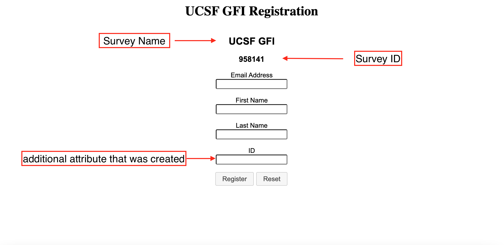

# Multiple Records for the Same Participant
There is no in-built LimeSurvey function to register a participant and have them be able to edit multiple responses. However, your participants can go to this site https://limesurvey.sdsc.edu/signup/signup.html?survey_id=[Your Survey ID] to register as a participant each time they want to submit a response. 

# Steps to set up Participants Table:
- Initialize Participants Table on your survey
- Add at least one survey participant attribute (click on the Manage attributes module)
    .
    - Choose an appropriate field description for the additional attribute
    - Enable <b>Show during registration</b> and <b>Mandatory during registration</b>
    - Remember to click save!
# Steps for participants to register for your survey
- Send this url to your participants and have them register at this url each time they want to complete a response
    - url: https://limesurvey.sdsc.edu/signup/signup.html?survey_id=[Survey ID]
    .
    - Participants will receive an email with the survey link to submit <b>one</b> response
    - To submit another reponse with the same email, please enter a unique answer in the additional attribute field that was created
        - In the example above, the additional attribute is <b>ID</b>
- Participants will be able to edit each response using the correponding survey link that was sent to the email they registered with