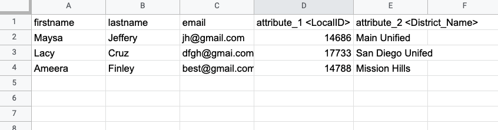
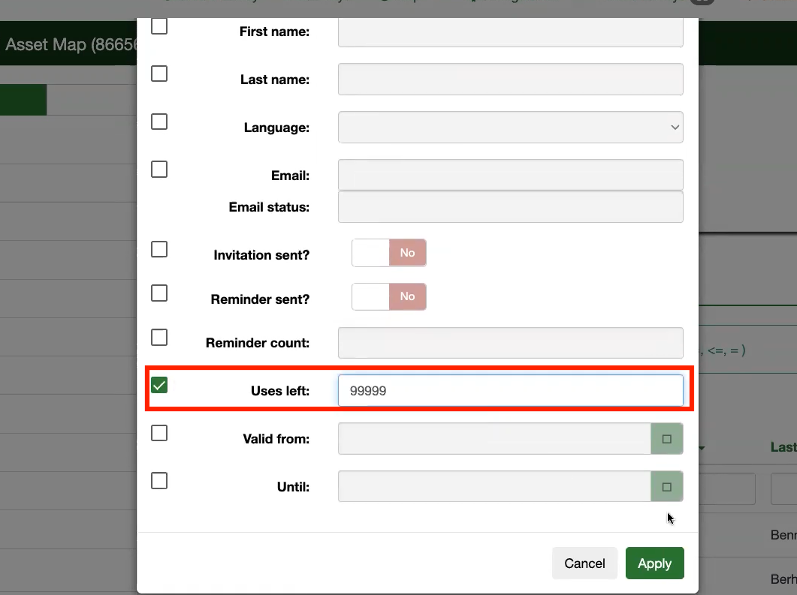
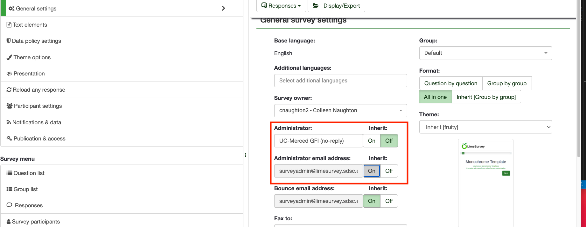

# {{page.title}}

# Preparing a class roster for import in LimeSurvey
You can import your class roster to limesurvey in order to fill the participants table. 
In order to do this you need to create a csv file. 
- The first line must contain the field names. It must contain the following fields: firstname, lastname, email. 
- Save the roster as a CSV file.
- Display attribute warnings: If enabled, after the importing process warnings will be displayed in case there is something wrong with the fields. For example. you might get an attribute warning if nothing is provided in any of the mandatory fields or if an email is incorrectly introduced in the CSV file.
- You can also import customized attributes when importing a CSV file. You will have to define what attributes will be added. You can do it like this:
    - email, attribute_1 \<LocalID\>, token, attribute_2 \<District_Name\>, lastname, firstname
    .
- Once you are done choosing the desired importing settings, do not forget to click on the Upload button.
## Creating a participant table and increasing the number of uses
Once you have imported your class roster as a csv file you’ll need to edit the participants table created on limesurvey. 
- In the settings section on the left hand side of the screen under “survey menu” you will see “survey participants”. If you click this you can select “display participants”.
- Now you will see the participants table (your class) for the survey. Here you may want to edit the “uses left”. This allows the survey participant (student) to access and complete the survey as many times as you set.
.
## Adding instructor and TA to the table:
- Under the settings menu on the left hand side of your survey, under the survey menu subheading click on “survey participants” and then click the “create” drop down menu before clicking “add participant”
- Now fill in the instructor or TA’s name and add their email
- You may want to add a larger number of uses than the default “1”. This allows the new participant to edit their survey responses once they have completed it for the first time. 
- If you leave the access code box blank you will need to click the “survey participants” option and then “generate tokens”.
    - This will generate access codes for all participants without them.
- Setting survey properties (eg. retaining timestamps to check submissions against deadlines; ensure response persistence)
- Using tokens to personalize survey greetings, and letting students confirm their information from the roster by setting up default answers to questions 
## Customizing email templates and the end message:
- Under the settings menu on the left hand side of your survey click on “email templates”.
- Here you are able to edit the invitation, reminder, registration and confirmation emails connected to your survey.
    - You will be able to send invitation and reminder emails to select participants through the participants table
    - Registration emails will be automatically sent to particpants once they registered to patricpate in your survey
    - Confirmation emails wiil also be automatically sent to particpants once they submit their responses
## Setting up a TA to receive update emails:
- Under the settings menu on the left hand side of your survey click on “general settings”.
    - You will see an administrator box, fill in your TA’s name and email in the appropriate boxes.
    .
    - If inherit is on, please press the off button in order to change the default value
## The testing/tuning process: what to expect when you deactivate/reactivate a survey
- There are two ways to stop a survey:
    - Expiration:	
        - No responses are lost.
        - No participant information is lost.
        - Ability to change questions, groups and parameters is still limited.
        - An expired survey is not accessible to participants (they only see a message that the survey has expired).
        - It's still possible to perform statistics on responses using LimeSurvey.
    - Deactivation:
        - All responses are not accessible anymore with LimeSurvey. Your response table will be renamed to: lime_old_[survey id]_[date]
        - All participant information is lost.
        - A deactivated survey is not accessible to participants (only a message appears that they are not permitted to see this survey).
        - All questions, groups and parameters are editable again.
        - You should export your responses before deactivating.
