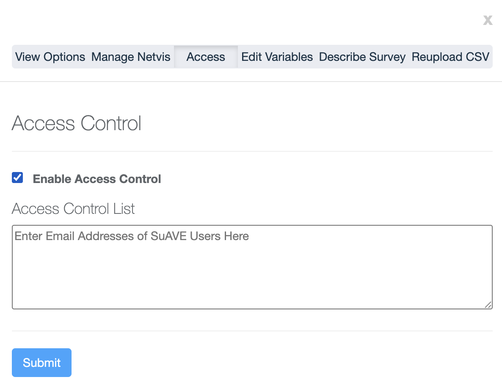
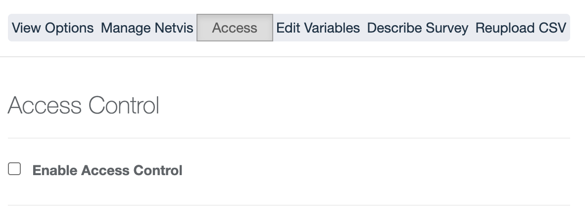

# How to Add Access Control in SuAVE

This guide walks you through adding access control to any survey in SuAVE, step by step with screenshots.

## Step 1: Navigate to Your Survey

Go to any survey where you want to add access control.

---

## Step 2: Click the Edit Button

Locate and click on the **Edit** button for the survey.

---

## Step 3: Go to Settings

After entering edit mode, click on **Settings**.

---

## Step 4: Click on the Access Tab

In the top bar of the settings menu, click on the **Access** tab.

---

## Step 5: Enable Access Control

Check the box to **Enable Access Control**.

---

## Step 6: Enter Email Addresses

In the text box provided, enter the email addresses of the SuAVE users you want to grant access to.

---

## Step 7: Save Your Changes

Click **Submit** to apply access control settings. Your survey is now restricted to the specified users!

---

That's it! You have successfully added access control to your survey.
