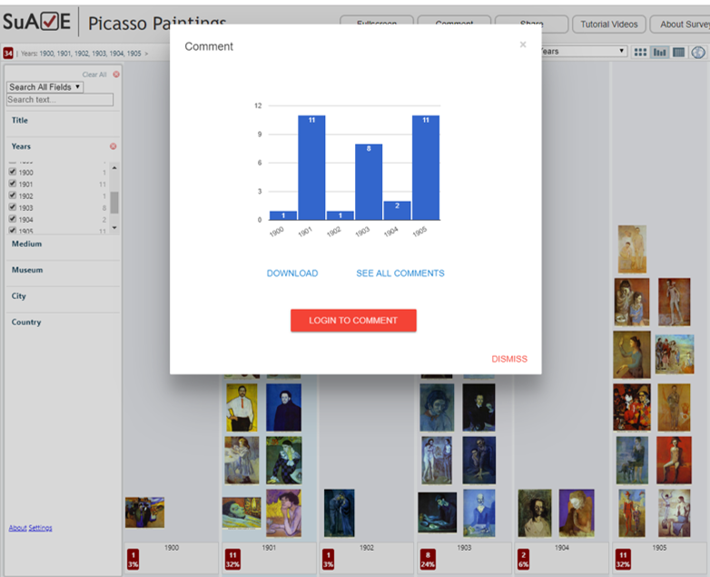

# {{page.title}}

SuAVE supports two types of annotations:

- annotations of individual objects (make sure you have an active object highlighted when you want to annotate it);
- annotations of distributions.

To create an annotation, click the “Comment” button in the top row,  to see the dialog below. It will show either the active object or the  current distribution. Once you log into your SuAVE account you will be  able to add annotation text. You can also see other annotations for  selected objects, and download the pattern or individual object view as a small png file (eg to include in a document).

 

For all surveys you have published, you will also be able to see annotations from your survey administration interface.

​                                                                                    
