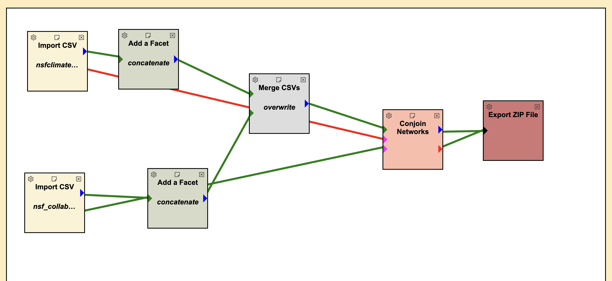
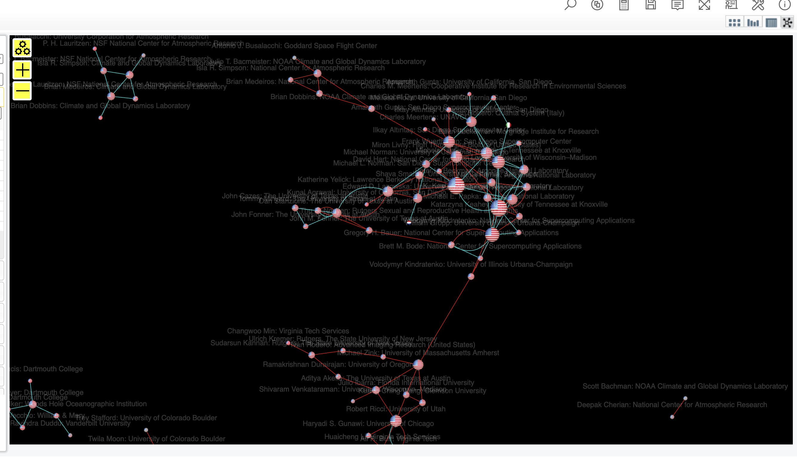

This guide explains how to process and combine two CSV files (`nsf_collaboration.csv` and `nsfclimateworkshop.csv`) using the **Conjoin Networks** workflow in SuAVE.


---

## Example Input CSVs

### Collaboration CSV (`nsf_collaboration.csv`)
```csv
Name,OAID,Affiliation,Country,City,Number of Collaborators in Scope,Collaborators in Scope
Aditya Akella,https://openalex.org/A5035329776,The University of Texas at Austin,United States,Austin,4,"A5085746671|A5082710354"
Alfred Anderson,https://openalex.org/A5040069168,The Ohio State University at Lima,United States,Lima,0,
```

### Climate Workshop CSV (`nsfclimateworkshop.csv`)
```csv
Name,OAID,Affiliation,Country,City,OA Concepts
Aditya Akella,https://openalex.org/A5035329776,The University of Texas at Austin,United States,Austin,"Distributed computing|Network routing|Machine learning"
Alfred Anderson,https://openalex.org/A5011242504,University of Chicago,United States,Chicago,"Geology|Volcanology|Chemistry"
```

---

## Step 1. Import CSVs
- Import both `nsf_collaboration.csv` and `nsfclimateworkshop.csv`.

---

## Step 2. Add Facets
Create extra combined fields to simplify later analysis.

- **Collab Info**: `Name + Number of Collaborators in Scope`  
  - Example: `Aditya Akella 4`
- **Author Info**: `Name + Affiliation + Country`  
  - Example: `Aditya Akella The University of Texas at Austin United States`

---

## Step 3. Merge CSVs
- **Merge key**: `OAID` (the unique author ID)  
- **Handle duplicates**: Overwrite (workshop data replaces collaboration where overlapping)

**Result (merged CSV):**
```csv
Name,OAID,Affiliation,Country,City,Number of Collaborators in Scope,Collaborators in Scope,OA Concepts
Aditya Akella,https://openalex.org/A5035329776,The University of Texas at Austin,United States,Austin,4,"A5085746671|A5082710354","Distributed computing|Network routing|Machine learning"
Alfred Anderson,https://openalex.org/A5040069168,The Ohio State University at Lima,United States,Lima,0,,
Alfred Anderson,https://openalex.org/A5011242504,University of Chicago,United States,Chicago,,,"Geology|Volcanology|Chemistry"
```

---

## Step 4. Edit Facets
Remove extra or hidden fields you don’t need:
- `Latitude`, `Longitude`
- `#img`, `#netvis`
- `Show Publications in Scope`

Keep only the **clean fields** you want in the final dataset.

---

## Step 5. Conjoin Networks
- Input the **merged CSV** plus the **two JSON networks**:
  1. Author ↔ Collaborators (from collaboration data)  
  2. Author ↔ Concepts (from workshop data)  

The **Conjoin Networks** block unifies them:
- Nodes = Authors  
- Links = Collaborators + Concepts  
- Attributes = Affiliation, Country, Publications, etc.  

ASCII-style example network:

```
Aditya Akella
   ├── Collaborates with → A5085746671
   ├── Collaborates with → A5082710354
   ├── Works on → Distributed computing
   ├── Works on → Network routing
   └── Works on → Machine learning
```

---

## Step 6. Export ZIP File
- Export the result as `nsf_conjoined.zip`.
- Upload this ZIP into SuAVE Survey to view the integrated network.

---

## ✅ Final Output
When uploaded into SuAVE, the result is an **interactive network visualization** where:
- Authors are connected to **collaborators** and **concepts**.  
- Each node can be explored by clicking to see its attributes.



---
