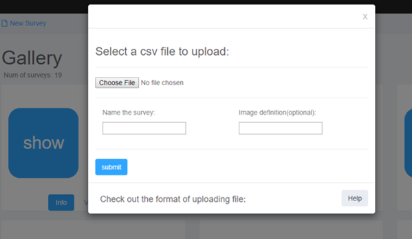
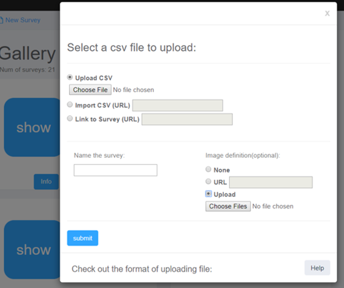

# {{page.title}}

There are several types of image galleries you can associate with your survey data files: see details in [Graphic Representation of Survey Data](http://suave.sdsc.edu/wp-admin/post.php?action=edit&post=3551)

In version 1 of SuAVE you can create image tiles by using SuAVE Deep Zoom Generator at [https://maxim.ucsd.edu/upload/.](https://maxim.ucsd.edu/upload/)

Organize the images you want to associate with a SuAVE survey, in a  directory on your local computer. In the SuAVE Deep Zoom Generator,  click “Select Images to Upload” and highlight all the images you want  for your collection. Enter your email address to be notified when the  images are processed. Select “*File server (preferred for large uploads)*” option for Storage Location, if you want to later process these images  with Jupyter notebooks. Click “Upload” and wait for a notification  email. You will get an email with the URL to the tile collection once  the images are processed. Then you copy and paste that URL in the “Image Definition” area of the survey creation dialog (see the Figure below).

You will receive the notification from [daemon@maxim.ucsd.edu](mailto:daemon@maxim.ucsd.edu) email address. Check the spam folder if you don’t receive the email in a  reasonable time. Note that tiling large image collections may take  several hours.

 

In version 2 of SuAVE you can create image tiles directly from the new survey  dialog, by pointing to a folder with images on your computer (as in the  figure below). 

 

To connect images with survey data records, add an #img column to  your survey file. Image file names should match respective values in the #img column. The images should have one of image file extensions (png,  gif, jpg, tiff, etc.)
