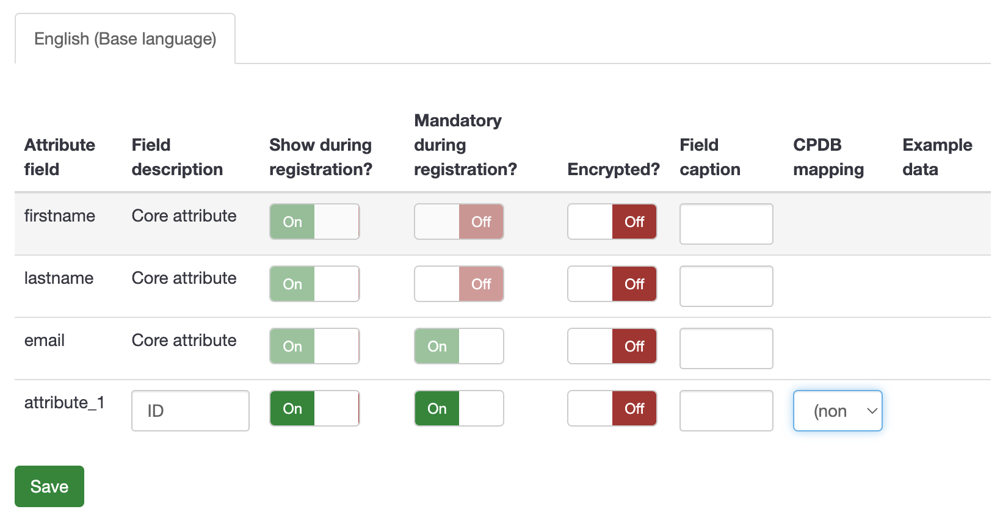

# Preparing your Existing Responses Spreadsheet
There is no in-built LimeSurvey function to register a participant and have them be able to edit multiple responses. However, your participants can go to this site https://limesurvey.sdsc.edu/signup/signup.html?survey_id=[Your Survey ID] to register as a participant each time they want to submit a response. 
Note: This is only necessary if you want your particpants to submit multiple reponses AND have them be able to edit each reponse

# Attach Images to Each Response
- Ensure each image has the correct image name and file extension

# Steps to set up Participants Table and Connect to Responses:
- Initialize Participants Table on your survey
- Add at least one survey participant attribute (click on the Manage attributes module)
    .
    - Choose an appropriate field description for the additional attribute
    - Enable <b>Show during registration</b> and <b>Mandatory during registration</b>
    - Remember to click save!
- Send a Reminder Email so that your particpants will receive the link to edit their response

# Update Corresponding SuAVE Gallery