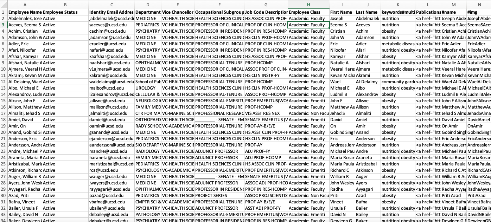

# Configuring LimeSurvey for an existing SuAVE

What you need: an existing SuAVE gallery you want to connect to LimeSurvey

Download your SuAVE gallery as a CSV file. To get the CSV file click on this icon (upper right-hand corner) on your SuAVE gallery.
.

# Steps to set up the corresponding LimeSurvey
- To create a survey, please follow this manual: https://suave-ucsd.github.io/SuAVE-Documentation/limesurvey_suave/limesurvey_setup.html
- Identify all the columns in your CSV that you want to include in your survey.
    .
    - For the example above, we want a question asking for the first and last name, the employee status, email address, department, vice-chancellor, occupational subgroup, job code description, employee class, keywords, and publication link for each participant. We will tackle the image column in a later step.
- Create a question for each column you identified.
    - For a question that has an infinite number of possible responses, like the participant’s name, you should choose to create a “short text”-type question. On the other hand, for a question with a finite number of possible responses, like the participant's employee status (Active or Paid Leave of Absence),  you should create a “list”-type question. 
        - For more guidance on creating LimeSurvey questions, please refer to this manual: https://manual.limesurvey.org/Questions_-_introduction 
    - If you want to create a “multiple short text” question, please ensure that for each subquestion, you have a corresponding column in your SuAVE CSV file. For instance, if your “multiple short text” question asks for First Name and Last Name as subquestions, ensure that your CSV file contains a column with all the first names and another column with last names.
    - Make sure to use the default code (i.e. A1, A2, …, An) when adding subquestions or answer options. Additionally, be sure to organize the subquestions or answer options alphabetically for questions with subquestions or answer options. For instance, with answer options like “Dog”, “Cat”, and “Neither”, code “A1” should correspond to “Cat”, code “A2” should correspond to “Dog”, and code “A3” should correspond to “Neither”.
- After you have created all the questions you want, activate your survey. Go to the responses table and export the responses as a VV file (please change the file extension to txt).

- To enable your participants to edit their existing responses, import a participants table. Refer to this manual: https://suave-ucsd.github.io/SuAVE-Documentation/limesurvey_suave/Preparing%20a%20class%20roster%20for%20import%20in%20LimeSurvey.html. 
    - Note: When importing your participants, make sure the order corresponds to the responses table (your SuAVE gallery) to easily transfer token information to the responses table. To get the same order, you may want to sort your responses and participants table by identifying column/s that exist for all responses and are in both your responses and participant table (for this example, it would be by the email column). Please ensure all your participants correspond to an existing response. After importing all your participants, generate tokens for all participants, then download the participants table as a CSV file.

- If you want to enable participants to edit their existing responses AND have them submit more than one response, please follow the instructions on this page: https://suave-ucsd.github.io/SuAVE-Documentation/Multiple_Records.html

# Steps to upload responses from your SuAVE to responses from LimeSurvey
Please download the jupyter notebook here:

Follow all the instructions in the notebook.

Now that you have your LimeSurvey set up, you would need to connect your survey to a Google Spreadsheet. Please follow the instructions on this page: https://suave-ucsd.github.io/SuAVE-Documentation/limesurvey_suave/google_sheets_setup.html

You would have to create a new SuAVE gallery to connect existing responses to LimeSurvey. To connect your Google SpreadSheet (created from the previous step), please follow the instructions on this page: https://suave-ucsd.github.io/SuAVE-Documentation/limesurvey_suave/suave_setup.html 