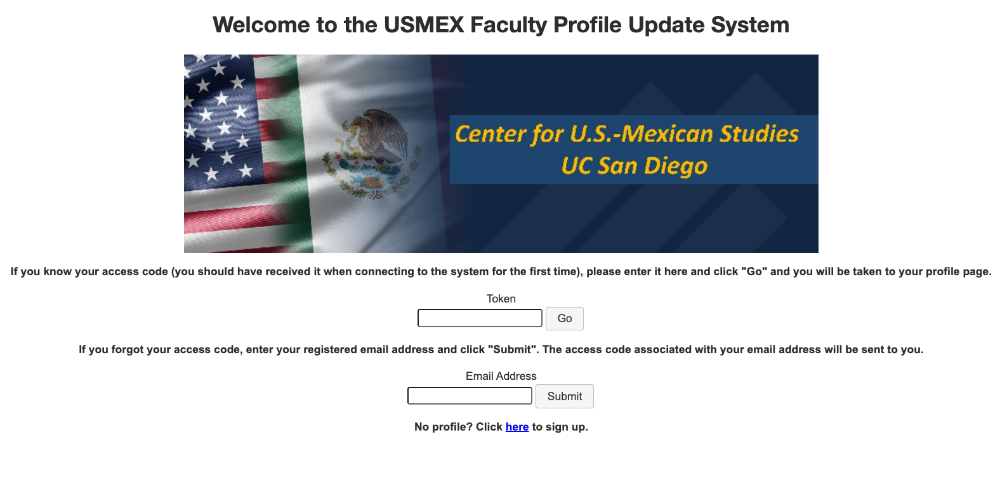

# When do you need a custom survey signup/registration form?
Often, SuAVE galleries allow users to update individual entries by selecting their profile in SuAVE and clicking "CLICK TO UPDATE YOUR ENTRY" in the right frame (e.g. [https://suave2.sdsc.edu/main/file=usmex_USMEX_Fellows.csv&view=grid](https://suave2.sdsc.edu/main/file=usmex_USMEX_Fellows.csv&view=grid)). In the mappings spreadsheet (which defines how LimeSurvey variables translate into SuAVE fields), this field is typically described as:

```
SuaveFieldName: Editing#hidden
ExpressionType: template
Mapper: "<a href='https://limesurvey.sdsc.edu/limesurvey/index.php/638892?' style='color:red;background-color: cyan;' target='_blank'>CLICK TO UPDATE YOUR ENTRY</a>"
```

Limesurvey includes a standard signup form, such as https://limesurvey.sdsc.edu/limesurvey/index.php/638892, in our example. We provide an option for the user to create a custom participant signup form, with a logo, title and prompts specific to the survey.

To point to this custom signup form, use the following Mapper expression:

```
Mapper: "<a href='https://limesurvey.sdsc.edu/signup/638892/' style='color:red;background-color: cyan;' target='_blank'>CLICK TO UPDATE YOUR ENTRY</a>".
```

For surveys with multiple responses per participant, although the link remains the same, the signup form looks a little different.

User would be directed to this page, asking for an access code that would connect them to their survey response. Alternatively, the user can also enter their email address and their access code will be sent to them. If the user has not created a response on your survey yet, they can sign up at the bottom of the page and they will be directed to the regular signup form mentioned above.

# Creating a custom signup form
1. Prepare a json file called 638892.config. The root name should be the Survey-ID in Limesurvey. The file should have the following content:

```
{
  "LandingPage": true,
  "Title": "Welcome to the USMEX Faculty Profile Update System",
  "Imagelocation": "https://limesurvey.sdsc.edu/limesurvey/upload/surveys/638892/images/USMEX_logo.jpg",
  "FirstPromptText": "If you know your access code (you should have received it when connecting to the system for the first time), please enter it here and click \"Go\" and you will be taken to your profile page.",
  "FirstPromptCaption": null,
  "SecondPromptText": "If you forgot your access code, enter your registered email address and click \"Submit\". The access code associated with your email address will  be sent to you. ",
  "SecondPromptCaption": null,
  "ThirdPromptText": "No profile? Click <a href=\"/signup/638892\">here</a> to sign up.",
  "SignupFormHeading1": null,
  "SignupFormHeading2": null
}
```
Feel free to modify the text of the title and the prompts

Once finished, download the file as a .json file. You can then edit the file type to be a .config file. **Caution**: Double check that it actually changed the file type, not just the file name. You can check this by seeing if the file name is 638892.config.json (incorrect) or 638892.config (correct).

2. Create an image file to include in the form. Recommended width is 600 px. Upload the image to Limesurvey, by selecting  Resources (a menu item on the left, under Survey menu) - Images - Upload. Make sure the file is correctly referenced under ImageLocation

3. The signup form config file (in our example, 638892.config) should be uploaded to Limesurvey under Resources - Files - Upload. Check that the file is available by opening the following page in the browser: https://limesurvey.sdsc.edu/limesurvey/upload/surveys/638892/files/638892.config  (the survey-id should correspond to your current survey.)

4. Alternatively, if you have root access, place the file onto limesurvey.sdsc.edu server, into /var/www/html/signup. Yet another option is to put the file into /var/www/html/limesurvey/upload/surveys/<survey-id>/files/ (the same directory is in item 3 above.)
