# {{page.title}}

### What you'll need:

- [ ] A Google account
- [ ] The Survey ID from the previous section
- [ ] The Question Codes from the previous section

### Create a new Google Spreadsheet

- Begin by visiting Google Sheets at [sheets.google.com](http://sheets.google.com)
- Create a spreadsheet

### Configure Spreadsheet Sharing Permissions

- Click the "Share" button in the top right of the Google Sheets Page

  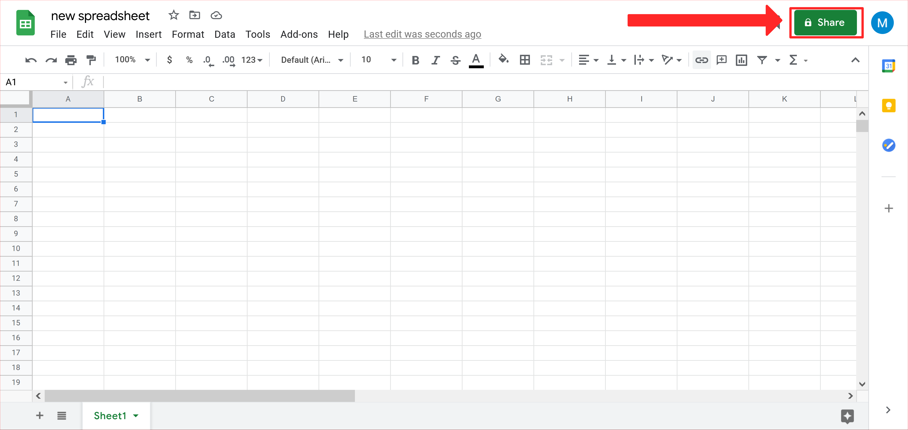

- You will be presented with the following menu:

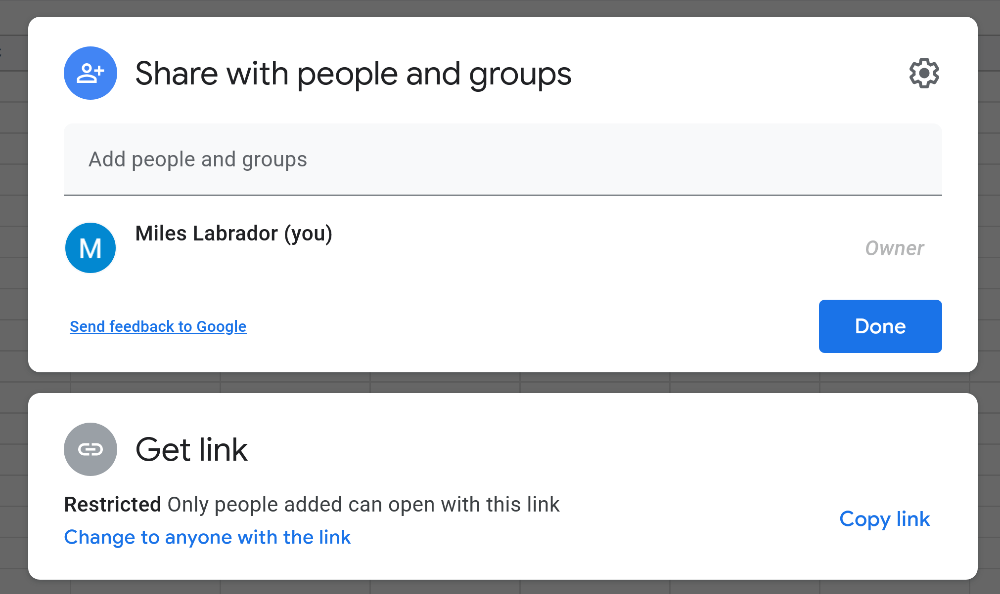

- In the box that says "Add people and groups" you will enter the following email:

```
limesurvey-flask@fusion-r2r.iam.gserviceaccount.com
```

- You will be prompted with this menu. Ensure that the share permission is set to "Editor."
- Press Send.

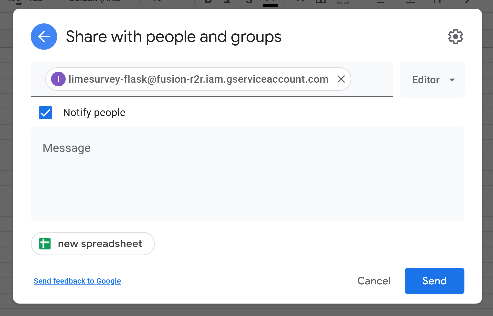

- Next go back to the share menu and under the "Get Link" menu, click "Change to anyone with the link"
  - This will ensure that SuAVE has permissions to read the spreadsheet for the collected data.

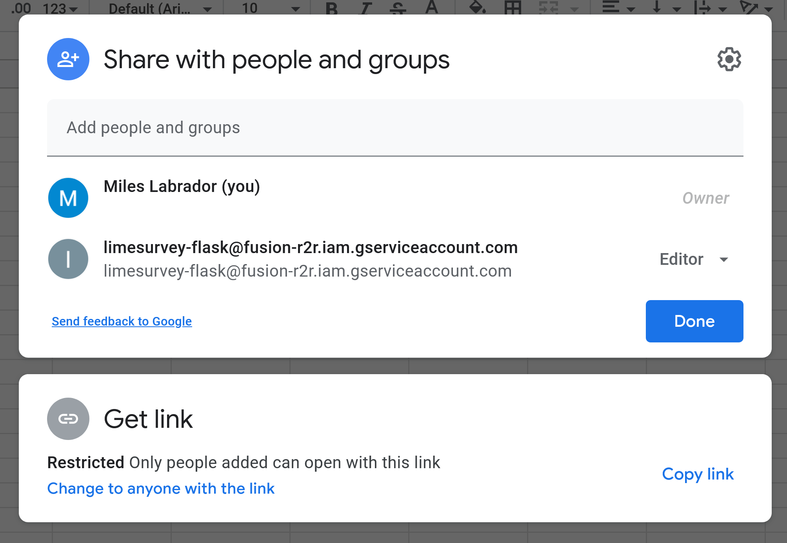

- Your share menu should now look like this. Ensure that the permission for "Anyone with the link" is set to "Viewer"


- Next, click "Copy link" and save it somewhere. **We will need it in a later step.**

## Configuring the Spreadsheet

- Rename the spreadsheet to the ID of your survey
- Create a new spreadsheet tab by clicking the "+" button on the bottom left of the screen.

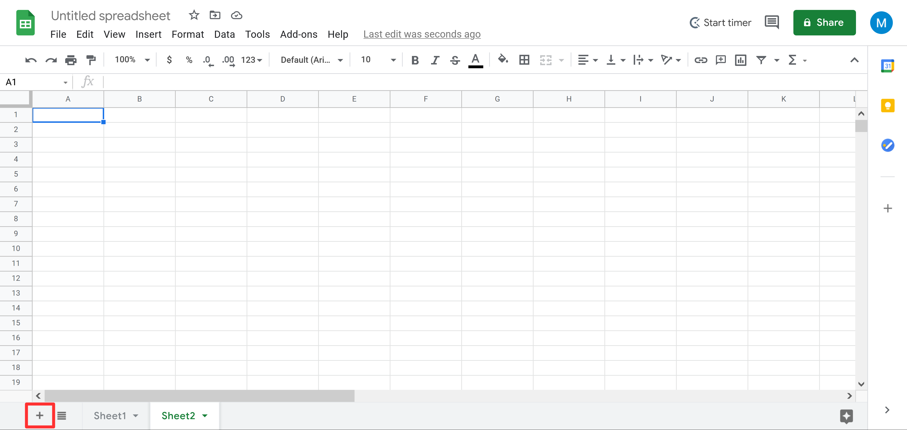

- Renaming the spreadsheet tabs

  - To rename a spreadsheet tab, right click on it or click on the triangle and select "Rename" from the menu.

  

  - Rename the first spreadsheet tab to the survey ID collected in the previous section. Make sure to rename the title of the spreadsheet to be the survey ID as well.

  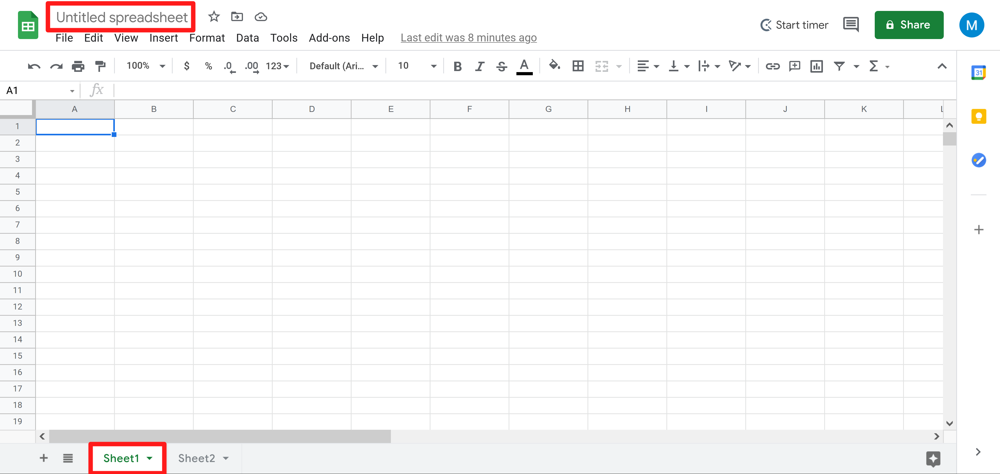

  - Rename the second tab to "mappings"

## Filling in the "mappings" tab:

- On the first row of your spreadsheet, add in the following values:

  - SuaveFieldName
  - ExpressionType
  - BasedOn
  - Mapper

- Next, we're going to fill in these columns with the relevant information

  ### **SuaveFieldName**

  - This is how the data will be labelled in SuAVE.

  - You can add "qualifiers" which change the way the response data is interpreted in SuAVE. These are not required, but are helpful.

    - Example: **Using the #sortquan qualifier to sort labels from responses by the amount of responses with that label.**

      - If you have a question in the survey with the question **"What region is your entry from?"** then you can add #sortquan at the end of the title you enter into the SuAVEFieldName column.

      ```
      SuAVEFieldName: Region#sortquan
      ```

      - In SuAVE, the search menu will sort the labels of the "Region" question responses by quantity.

      

  ### **ExpressionType**

  - The ExpressionType column helps format the response that is collected in limesurvey into the final entry that is presented in SuAVE.

    - A list of possible expression types are:

      - copy, dict, multi_from_dict, geoLa, geoLo, template

    - copy:

      - Makes a direct copy from the question response to what is displayed in the feature in SuAVE.

      - This is useful for questions with text boxes in LimeSurvey

      - No Mapper is needed

      - **Example: Simple Copy**

        - If we simply want to copy the exact response from our survey question (with question code "favorite_sport") over to SuAVE, we would use the "copy" expression type with a configuration that looks like this:

          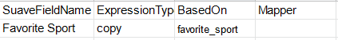

    - multi_from_dict:

      - Very similar to dict, allows a survey response entry to be labelled and filtered by more than one label.

      - **Example: Question of type "Multiple choice (M)" in LimeSurvey**

        - Under SuAVEFieldName, you will want to add the "#multi" qualifier after your desired feature title.
        - If you go to your question in LimeSurvey and scroll down you will see a tab titled "Subquestions." Clicking that will display the subquestion codes that you can make a dictionary of.

        

        - Scroll down when you get to your question in LimeSurvey

        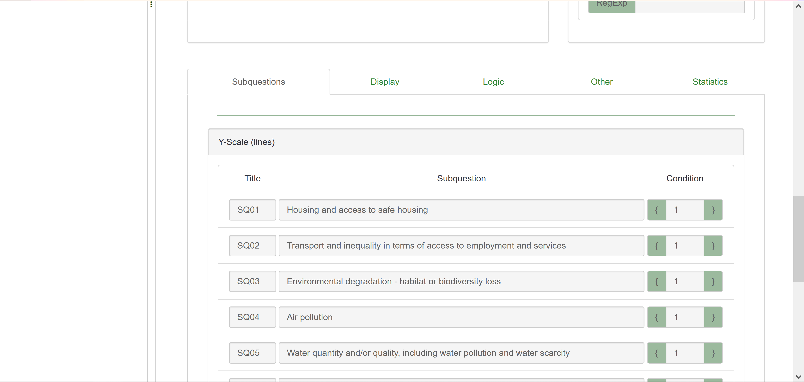

        - Create a list of the subquestions that you would like to display in SuAVE like below.
          - Each item should be in the format of "QuestionCode[SubquestionTitle]"

        ```
        Challenge[SQ01],Challenge[SQ02],Challenge[SQ03],Challenge[SQ04],Challenge[SQ05],Challenge[SQ06],Challenge[SQ07],Challenge[SQ08],Challenge[SQ09],Challenge[SQ10],Challenge[SQ11],Challenge[SQ12],Challenge[other]
        ```

        - We will enter this list into the BasedOn column of our "mappings" spreadsheet

        - Next, under our "Mapper" column we will format each subquestion in the format of:

          ```
          {'QuestionCode[SubquestionTitle1]':'Name to be displayed for option 1','QuestionCode[SubquestionTitle2]':'Name to be displayed for option 2'}
          ```

        - In our case, we end up with this entry:

          ```
          {'Challenge[SQ01]':'Housing and access to safe housing','Challenge[SQ02]':'Transport and inequality in terms of access to employment and services','Challenge[SQ03]':'Environmental degradation - habitat or biodiversity loss','Challenge[SQ04]':'Air pollution','Challenge[SQ05]':'Water quantity and/or quality, including water pollution and water scarcity','Challenge[SQ06]':'The arrival of refugees and migrants from other areas','Challenge[SQ07]':'Livelihoods - access to stable employment','Challenge[SQ08]':'Food systems - access to and/or ability to produce food in and around the city','Challenge[SQ09]':'Massive land acquisition by private actors','Challenge[SQ10]':'Energy and alternative energy sources (decarbonization)','Challenge[SQ11]':'Climate change adaptation (to extreme events and stressors)','Challenge[SQ12]':'Urban-rural linkages','Challenge[other]':'Other'}
          ```

        - This is how our question is represented in SuAVE, allowing us to sort the responses by the tags that were derived from our subquestions.

          

    - dict:

      - Good for questions that come with sub-questions.
      - If a response can be filtered/identified by a specific label that is designated in a question, then a dict is a good option
      - The setup is the same as multi_from_dict, without the #multi qualifier

    - geoLa/geoLo

      - If a question uses the "Short Free Text" question type that asks respondents to select a location on a map, then these ExpressionTypes will be required to display responses on a map in SuAVE
      - With a question that has the QuestionCode of "Latlon" we will add two rows into our "mappings" spreadsheet and enter the configuration as follows:

      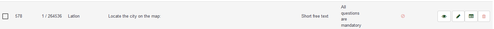

      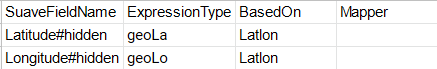

    - template

      - The template ExpressionType allows us to format question responses in a way ttha

      - Example: **Combining two questions asking for last and first name into one feature in SuAVE.**

        - the template expression will allow us use the "Mapper" column to specify how our question responses show up in SuAVE.

        - In this case, there are two separate questions with the codes: Fname and Lname.

        - Here a student submits their first and last name in the separate respective questions and the mapper formats the responses to show their last name first followed by a comma and space and then their first name.

          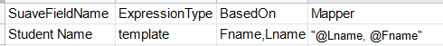

          

  ### **BasedOn**

  - In the previous step, we collected a list of question codes that we wanted to display in our SuAVE survey.
  - In this column, you can add one or more question codes to use in the row
  - The examples above exemplify how BasedOn should be filled given your question codes.

  ### **Mapper**

  - This field is used in tandem with certain ExpressionTypes to format question responses in a specific way.
    - The examples from above help exemplify how each ExpressionType expects the Mapper column to be formatted.

### Reserved column names:

- These are names that, if you were to put them into the "SuAVEFieldName" section alone, they would fill special spots in SuAVE.

  - For Example, imagine this setup:

    ```
    SuAVEFieldName: #img
    ExpressionType: image
    BasedOn: ProImage
    Mapper: "@ProImage"
    ```

    - The #img special column name is responsible for taking survey questions that require you to upload an image, and display them as tiles for each individual response in SuAVE as shown here:

    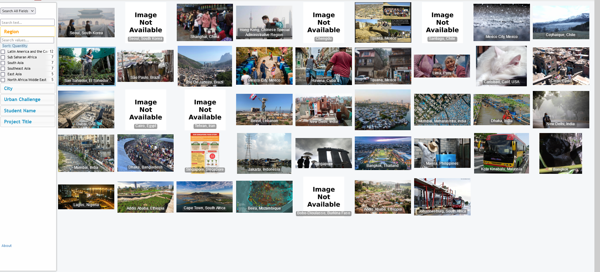

    - Starting with BasedOn, we see that we're pulling from the survey question that has the ID of "ProImage"
    - Next, the value for Mapper shows that we are formatting SuAVE to just insert the response data from our question with no extra characters.
    - The ExpressionType explicitly tells SuAVE to format our file upload question response as an image.

### Testing:

- When setting up the mapping from LimeSurvey to Google spreadsheet, it is recommended that you should check one line of mapping at a time (e.g. type in the map for survey participant's names and test to see if it works). To do that efficiently, use the following website: [https://limesurvey.sdsc.edu/limesurvey-update](https://limesurvey.sdsc.edu/limesurvey-update)
- Note that you will be prompted for a username (lsadmin) and a password(VocalMimic).
- The point of this website is to force the spreadsheet to refresh so you don't need to fill out a new survey for testing purpose every time you change something in the mapping.

### Checkpoint

- By now you should have **a link to a google spreadsheet,** which is formatted in the method described above.
- Checklist
  - [ ] Google Spreadsheet Link
