# {{page.title}}

The first part of this tutorial begins in LimeSurvey. Here, we're going to begin setting up our survey to collect our data.

Begin by logging into your LimeSurvey account. You will see one or more actions to take. For now we're going to click on the "List Surveys" option


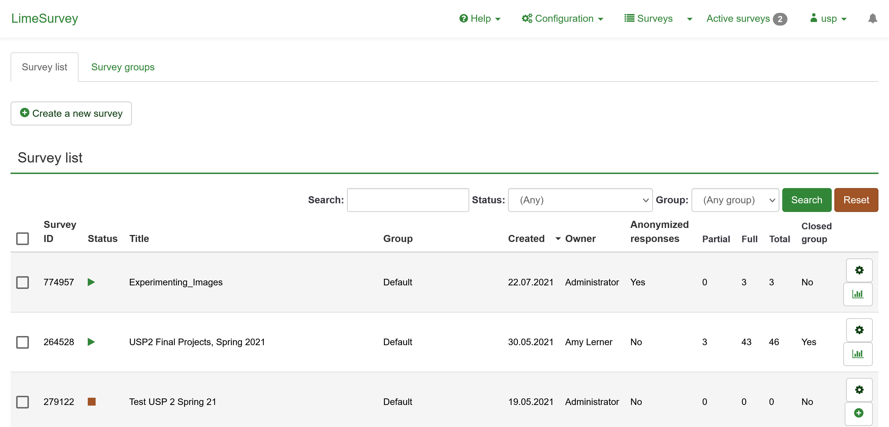

This is the LimeSurvey homepage. Here you can create surveys, or monitor the ones you've created.

Here we can view the surveys we have created along with their basic information such as whether or not a survey is actively taking responses or how many responses we've received thus far.

### Creating a Survey

There will be a button in the top left corner of the homepage that reads "Create a new Survey." Press this to begin the survey creating process.

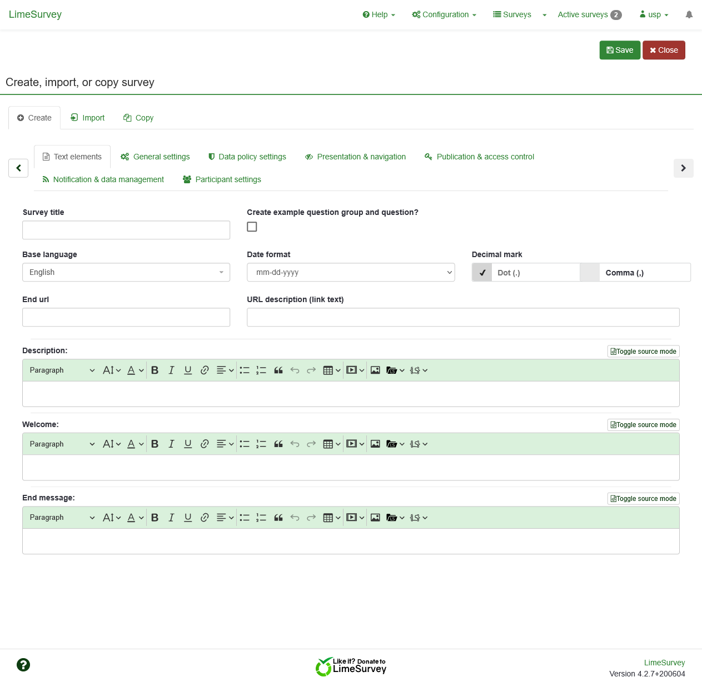

Here we have many options to customize the functionality of our survey. You can read more about the specifics of each option [here, as part of LimeSurvey's documentation.](https://manual.limesurvey.org/Surveys_-_introduction)

To begin, enter the title of your survey. Here you can also enter a description for the survey and a welcome message, which the users will be able to read before they begin their survey response. We will revisit the "End message" soon, but first we need to save the survey in order to initialize it.

Press the "Save" button in the upper right hand corner.

### Write Down Your Survey ID

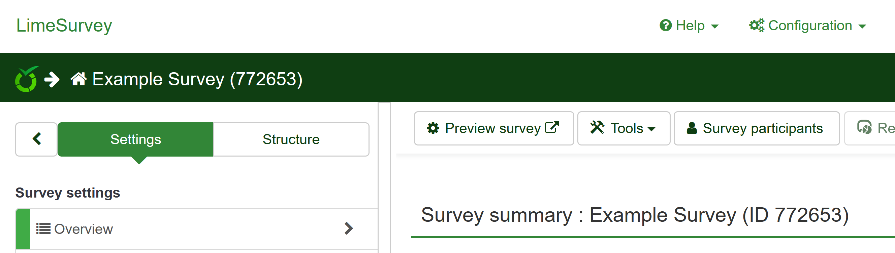

After saving, you should be redirected to your survey homepage. Here, you can revise the settings of the survey and make changes to it's functionality.

You should see a number in parenthesis next to the title of your survey. Write this number down as we will need to use it in the following step.

- For example, in the above picture we see that our Survey ID is 772653

### Create an End Message

Next, we're going add an end message and include an important piece of code that allows our survey to function correctly.

Select the menu item titled "Text elements" in the sidebar of your survey homepage.

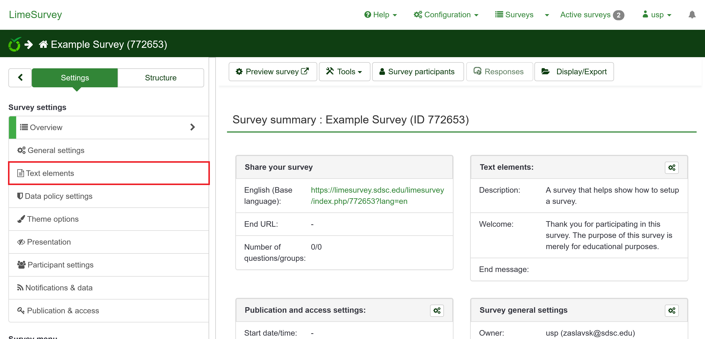

You will now see a page that looks very similar to the starting page of our survey creation.

Click on the toggle that reads "Toggle Source Code" to the right of the End Message block. 

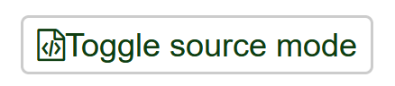

Your End Message block should now look like this:

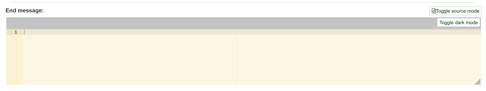

Copy this block of code and paste it into the "End Message" block

```jsx
<script type="text/javascript" charset="utf-8">
	$(document).ready(function(){
		$.ajax({
			url: 'https://limesurvey-flask.sdsc.edu/',
			type: 'GET',
			dataType: 'json',
			data: { survey_id: 123456 },
			success: function(data){
				console.log(data);
			}
		});
	});
</script>
<p>Thank you for participating in this survey!</p>
```

**Important:** Replace the "123456" in the code with the survey id you wrote down in the previous step. Your SuAVE setup will not work without doing so. Also, make sure there are spaces around the curly braces in the "data: { survey_id: 123456 }" line.


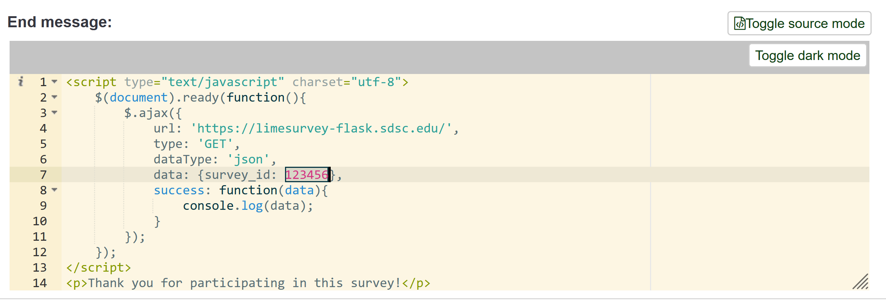

Before adding our unique survey ID

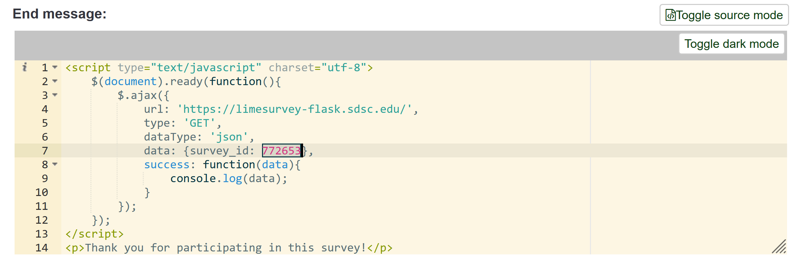

After adding our unique survey ID

You can then add whatever ending message you want by adding more html code, or replacing the text that says "Thank you for participating in this survey!" For example, you can enter 

```jsx
<p>Thank for your submitting your information!<br>&nbsp;</p><p>To edit your responses to this survey, click <a href="https://limesurvey.sdsc.edu/limesurvey/index.php/123456?token={TOKEN}&amp;lang=en">https://limesurvey.sdsc.edu/limesurvey/index.php/123456?token={TOKEN}&amp;lang=en</a></p><p>Your access code for this survey is: {TOKEN}.</p><h3>To view survey responses in SuAVE <a href="https://suave2.sdsc.edu/main/file=surveyauthor_surveyname.csv&amp;view=grid">Click here</a></h3>
```

**Important:** Make sure you press the green save button in the top right before moving on to the next step.

After Saving, you can click the "Toggle Source Code" button again in order to preview what the ending message will look like. This is what the above source code looks like to the survey participant:


- **Note:** If you want to change the end message in the future, you may have to repeat this step and paste in the code again

### Adding Questions:

- Next, navigate to the "Group list" tab on the left navigation bar

  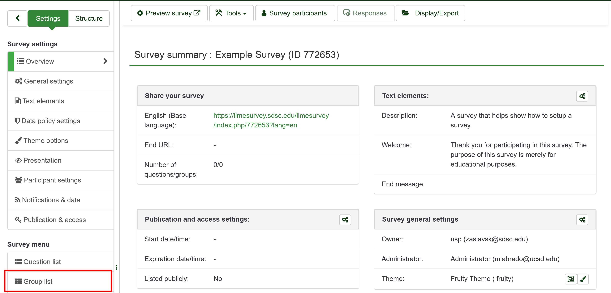

- We're going to begin by creating a question group, which is essentially a set of questions that will be grouped together on a single page in your survey.

Note that there must be at least one question group, since each question has to belong to a question group, but it is not required to have more than one question group.

- This is what the question group page looks like:


- Your question group does not require any of the fields to be filled in, however we recommend you at least add a title, which will help identify the question group and will show up on the top of page when the survey questions are presented.
- You can read more about question groups in the official [LimeSurvey Documentation here.](https://manual.limesurvey.org/Question_groups_-_introduction)
- When done configuring your question group, make sure you press the green "Save" button in the top right.
- Next, add a question by clicking "Add Question" in the left navigation bar, or by clicking "Save and add question" in the top right
  - To view questions and question groups in the left navigation bar, you will have to select the "Structure" option at the top of the navigation bar.

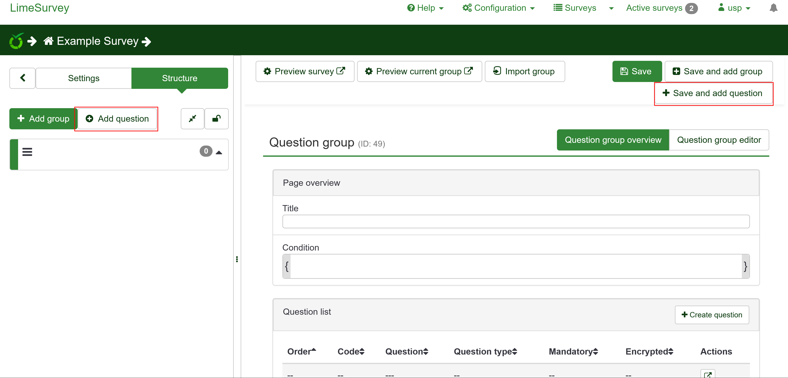

- Next, we will setup the survey questions in order to collect the data that we'll present in SuAVE.

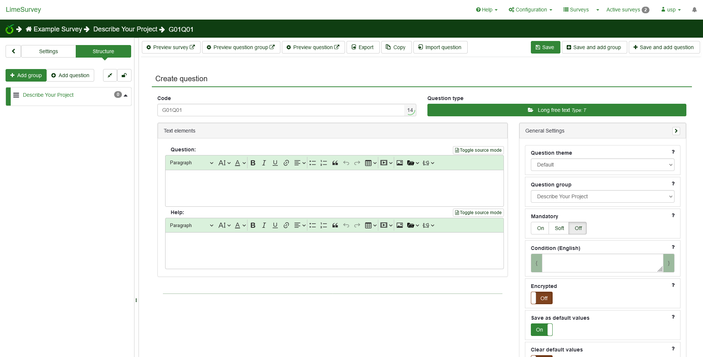

Survey questions are very versatile and are able to handle many data formats, including but not limited to: multiple choice selections, images, and free form text.

- You can read more about setting up questions in the official [LimeSurvey Documentation here](https://manual.limesurvey.org/Questions_-_introduction).
- Once you have configured your question, ensure you save it by pressing the green "Save" button in the top right.

### Collecting Question Codes

- Each question has a question code that is either user defined or automatically assigned, which we will need in order to funnel the data into SuAVE. In this step, we're going to collect those question codes.

- In the left navigation bar select the "Settings" toggle in the top left and click "Question list."

  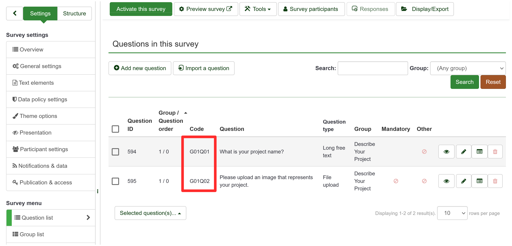

  - Write down a list of the question codes of the questions that contain information that you would like to display in SuAVE. We will need these for the following step.

### Activate Survey

- When you are done configuring your survey, you will need to activate it in order for it to be open to responses.

- In the toolbar at the top of the page there will be a green button titled "Activate Survey" which will take you through the activation steps.

  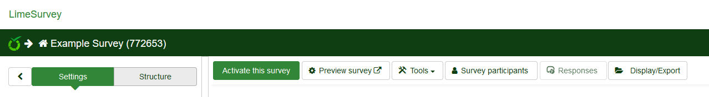

You can use the "Preview survey" button to get a preview of what the survey respondents will see before activating your survey.

### Checkpoint

- By now you should have the **survey id** and a list of the **question codes** that pertain to the responses you would like to display in SuAVE
- Checklist
  - [ ] Survey ID
  - [ ] Question Codes
