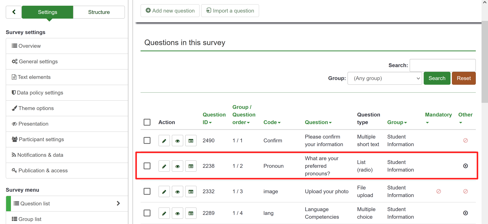
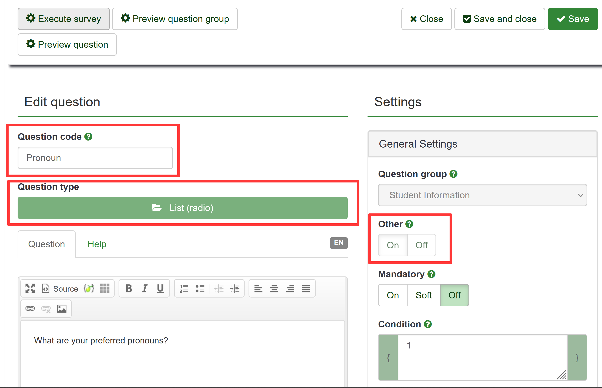
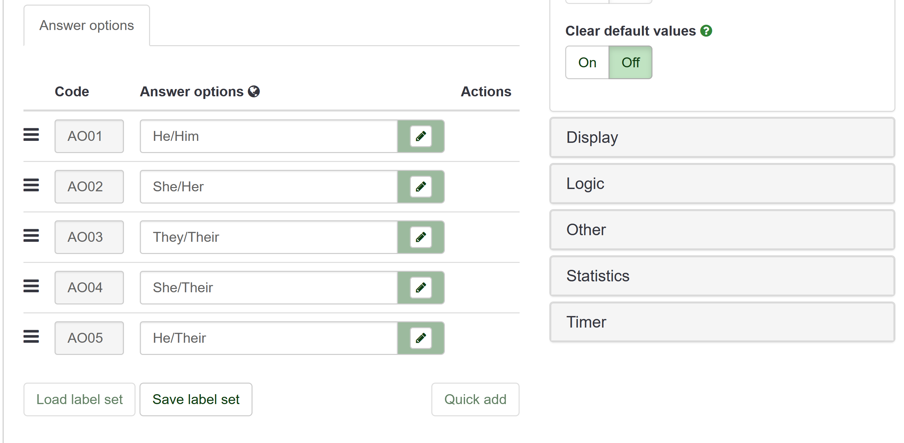
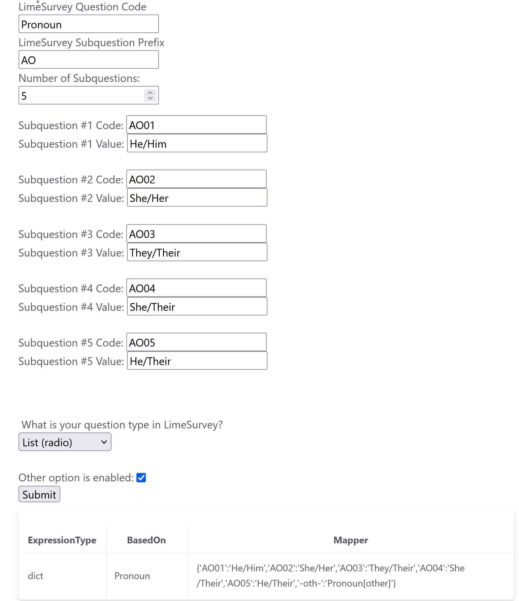

# {{page.title}}

<html>
    <body>
        <!-- Create a form where we can insert our limesurvey question parameters -->

        <form name='myform'>
          <label for="ls_q_code">LimeSurvey Question Code</label> 
          <input type="text" id="ls_q_code" name="ls_q_code">
           
          <label for="sub_q_prefix">LimeSurvey Subquestion Prefix</label>
           
          <input type="text" id="sub_q_prefix" name="sub_q_prefix">
           
          <label for="num_sub_q">Number of Subquestions:</label> 
          <input type="number" id="num_sub_q" name="num_sub_q" min="1">
          <!-- Add section where we can specifically house subquestion inputs -->
          

          

           

​        

          <label for="question_type">What is your question type in LimeSurvey?</label>
           
          <select id="question_type" name="question_type">
            <option value="multiple_choice">Multiple choice</option>
            <option value="list_radio">List (radio)</option>
          </select>
            
    
          <label for="other_enabled">Other option is enabled: </label>
          <input type="checkbox" id="other_enabled" name="other_enabled">
           
          <button type="button" id="submit_button">Submit</button>
          <!-- Table to display the mappings that we have created. -->
          <table>
            <tr>
                <th>ExpressionType</th>
                <th>BasedOn</th>
                <th>Mapper</th>
            </tr>
            <tr id="tabular_results">
            </tr>
        </table> 
        </form>
        
    </body>
</html>
# How to use this tool:

* This page will help you construct the correct structure for your mappings spreadsheet in google sheets for the LimeSurvey question types: **Multiple Choice and List**. 
* To use this tool you will need the following information from LimeSurvey:
  * The Question Code of the LimeSurvey question you are mapping
  * The Subquestion Codes of the LimeSurvey question you are mapping
    * With the default LimeSurvey setup, these subquestion codes are automatically generated and can be automatically filled in using this tool given the ***prefix*** and the ***number of subquestions*** you have in your question
  * The Subquestion Options of the LimeSurvey question you are mapping
    * These are the readable names that respondents can select as part of a multiple choice or list question.
  * The number of subquestions present
    * Do not count any "other" question when determining this number
  * Whether or not the "Other" option is enabled
    * This option in LimeSurvey is responsible for allowing respondents to write in another answer if the pre
  * The Question Type
    * This can either be Multiple Choice or List

### Example 1:

* To find this information I am going to navigate within our survey in LimeSurvey to Settings > Questions list > then click on the edit icon (pencil) to the left of the question that we are interested in.  
* Now, we are taken to the question edit page, where we can find the information we need.
* 
* From the top of the page we can extract the following information:
  * `Question Code: Pronoun`
  * `Other option is enabled: yes`
  * `Question Type: List (radio)`
* 

* Scrolling down we find the Subquestion information and can extract this information:

  * `Subquestion Prefix: AO`
  * `Number of Subquestions: 5`
  * `Subquestion options: He/Him, She/Her, They/Their, She/Their, He/Their`

* Now this is what the tool looks like with all of the relevant information inputted:

  

* Now we can copy the results from this table directly over into the spreadsheet with the methods outlined earlier in the Limesurvey Setup section of the documentation.