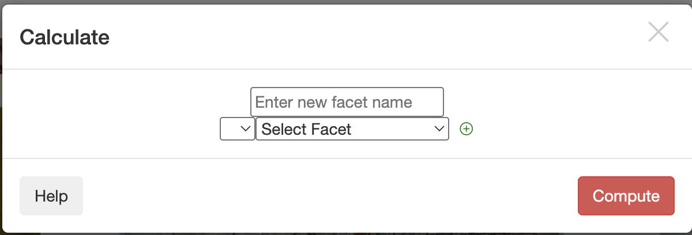

# Variable Calculator

In the **Variable Calculator** function, when numerical variables are present, you can select a numerical facet and choose the desired calculation method from the options on the left. Then, enter a name for the result to create a new variable. After clicking **Compute**, the result will appear on the page.

### Where to Find the Variable Calculator

*The Variable Calculator button, located in the toolbar, looks like a small calculator icon.*

### Selecting Numerical Facet

