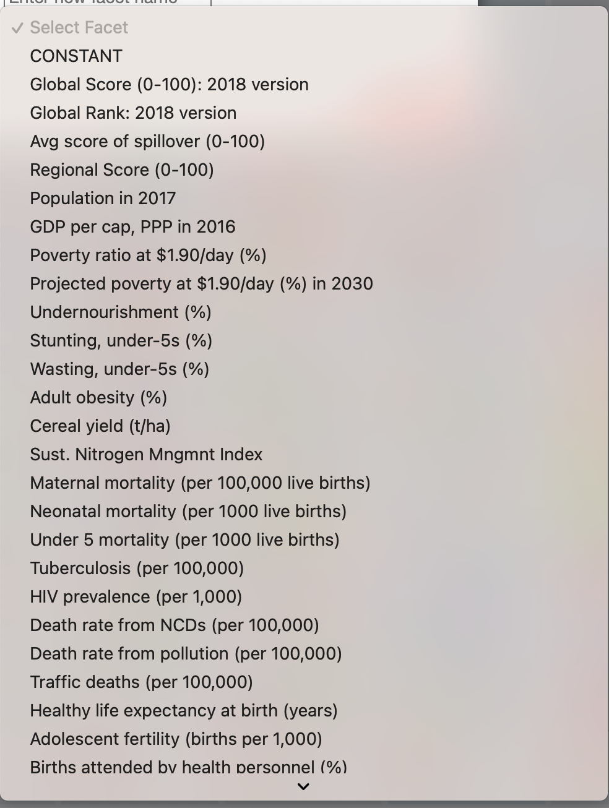
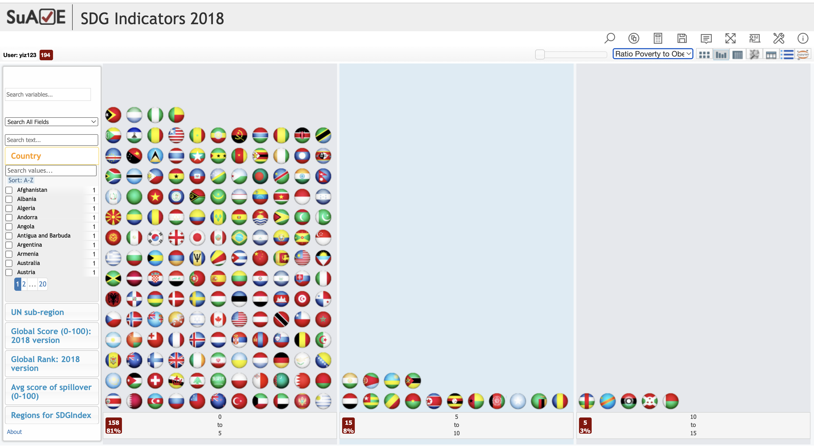
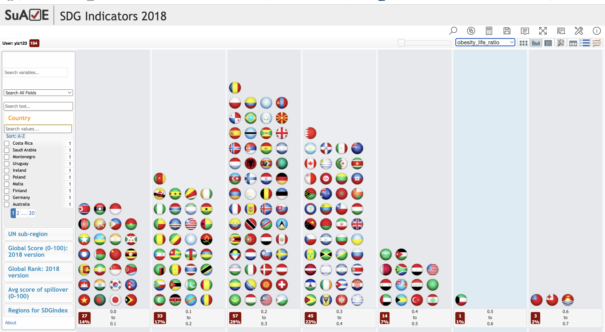
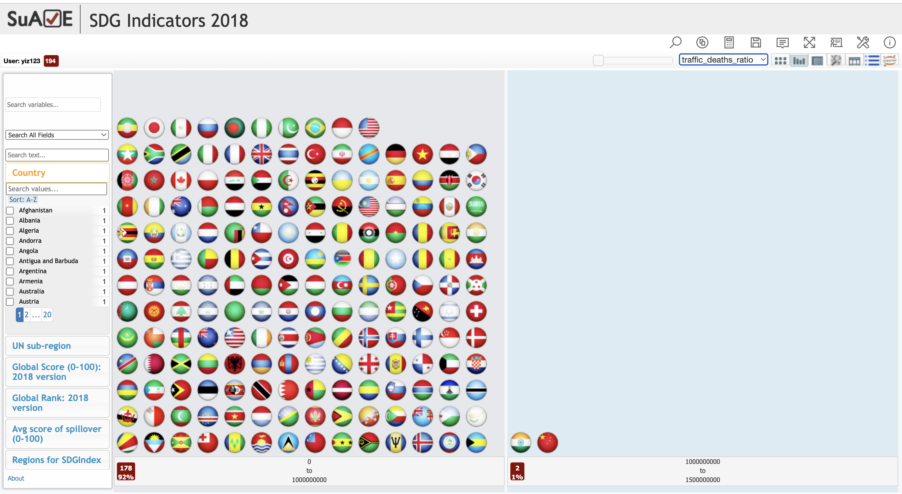

# Variable Calculator

In the **Variable Calculator** function, when numerical variables (facets) are present, you can select a numerical facet and choose the desired calculation method from the available options. Then, enter a name for the result to create a new variable. After clicking **Compute**, the result will appear as a new facet in the dataset.

### Where to Find the Variable Calculator
  
*The Variable Calculator button, located in the toolbar, looks like a small calculator icon.*

---

### Creating a New Variable
  
*To create a new facet (variable), enter a name in the input box and select one or more numerical facets to compute with. You can chain operations together, add more by clicking the green "+" icon, and click the red "Compute" button to generate your result.*

---

### Selecting Numerical Facets
  
*When clicking the facet dropdown, you'll see a list of available variables. These include indicators such as:*

- `GDP per cap, PPP in 2016`
- `Poverty ratio at $1.90/day (%)`
- `Stunting, under-5s (%)`
- `Traffic deaths (per 100,000)`
- `Healthy life expectancy at birth (years)`
- `Goal 3 Score` (related to health and well-being)

You can select any of these for operations like addition, subtraction, multiplication, division, or monadic functions such as summation or negation.

---

### Example Calculation
Let’s say we want to calculate a ratio between two variables:

```text
poverty_ratio_per_gdp = [Poverty ratio at $1.90/day (%)] ÷ [GDP per cap, PPP in 2016]
```



---

### More Examples

### Example 1: Poverty per GDP Dollar
- **Variables**:  
  - Poverty ratio at $1.90/day (%)  
  - GDP per cap, PPP in 2016
- **Formula**:  
  poverty_per_gdp = Poverty ratio / GDP per cap
- **Interpretation**:  
  Measures how much poverty exists per unit of economic output per person.


---

### Example 2: Obesity vs. Life Expectancy
- **Variables**:  
  - Adult obesity (%)  
  - Healthy life expectancy at birth (years)
- **Formula**:  
  obesity_life_ratio = Adult obesity / Life expectancy
- **Interpretation**:  
  Gives a normalized view of obesity burden relative to how long people live healthily.



---

### Example 3: Road Safety Indicator
- **Variables**:  
  - Traffic deaths (per 100,000)  
  - Population in 2017
- **Formula**:  
  traffic_deaths_ratio = Traffic deaths / Population
- **Interpretation**:  
  A proxy for traffic death burden per person.



---

### Saving and Viewing Results

If you want to **save the result variables to the survey**, you can click on the **Save** button located at the top right of the page.

To **review what you’ve written for the new variable**, click the dropdown in the upper right corner. This allows you to see uyour computed facets.
